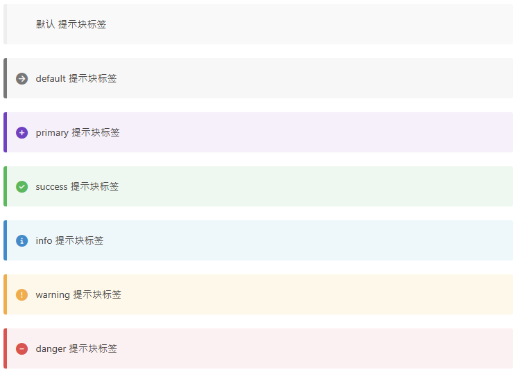

## 一、Rront-matter

### 1. Page Front-matter


### 2. Post Front-matter


## 二、Special MD-Syntax

### 1. 标签外挂

#### 1）Note

- 语法

  ```markdown
  
  Any content (support inline tags too.io).
  
  ```

  - `class`【可选】：不同的表示有不同的配色（`default`、`primary`、`success`、`info`、`warning`、`danger`），不填即为`default`
  - `no-icon`【可选】：不显示 `icon`
  - `style`【可选】：已在配置文件中配置过（`simple`、`modern`、`flat`、`disabled`）

- 效果

  


#### 2）Tabs

- 语法

  ```markdown
  
  <!-- tab [Tab caption] [@icon] -->
  Any content (support inline tags too).
  <!-- endtab -->
  
  ```

  - `Unique name`【必填】：标识该 Tabs
  - `index`【可选】：决定使用哪个 tab 作为默认显示，正常值为正整数，-1 表示不默认显示任何一个 tab
  - `Tab caption`【可选】：显示在 tab 上的文字
  - `@icon`【可选】：显示在 tab 上文字之前的图标

- 效果

  


#### 3）label

- 语法

  ```markdown
  
  ```

  - `text`【必填】：文字
  - `color`【可选】：背景颜色，默认为`default`。（`default`、`blue`、`pink`、`red`、`purple`、`orange`、`green`）

- 效果

  

